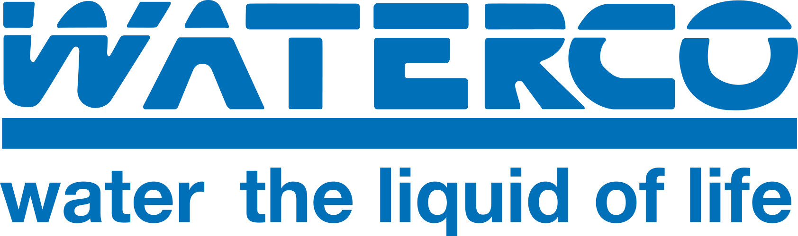

# Electrochlor Home Assistant Integration

The `electrochlor` custom component integrates **Waterco's Electrochlor Mineral Chlorinator** with Home Assistant, enabling automation and monitoring of pool sanitization and filtration systems. This integration allows users to access real-time data and control various aspects of their pool equipment directly from the Home Assistant interface.

## Features

- **Real-Time Monitoring**: Displays current pool temperature, chlorine production levels, and system status.
- **Automation Support**: Facilitates automation of sanitization cycles and filtration schedules based on sensor data.
- **System Alerts**: Provides notifications for system errors or maintenance needs.
- **Compatibility**: Designed to work seamlessly with Waterco's Electrochlor Mineral Chlorinator systems.

## Installation

1. Clone or download the repository.
2. Place the `electrochlor` folder into your Home Assistant's `custom_components` directory.
3. Configure the integration in your `configuration.yaml` file.

## Usage

Once installed, the component will create **sensors** and **switches** in Home Assistant representing various aspects of the Electrochlor system. These entities can be used in dashboards, automations, and scripts to monitor and control your pool's sanitization and filtration processes.

## Notes

- Ensure your Electrochlor system is connected to the network and accessible by Home Assistant.
- Refer to the [Waterco Electrochlor Manual](https://www.waterco.com.au/waterco/manuals/pool-spa/chlorination/electrochlor-mineral-chlorinator_manual_jan18_single.pdf) for detailed information on your system's capabilities and setup.
- For advanced configurations or troubleshooting, consult the component's documentation and the Home Assistant community forums.

---

This integration enhances the functionality of your Electrochlor system, providing greater control and insight into your pool's maintenance.
